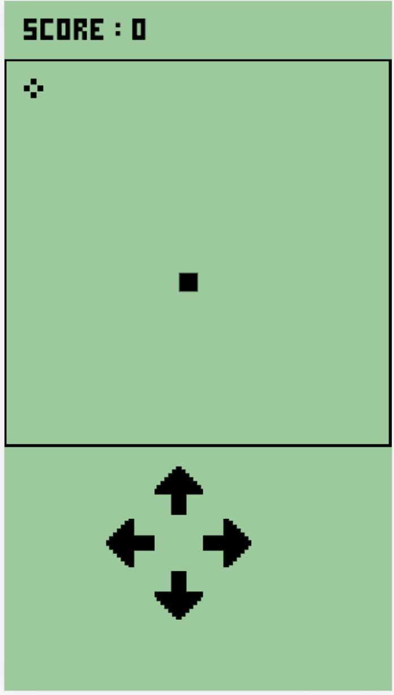
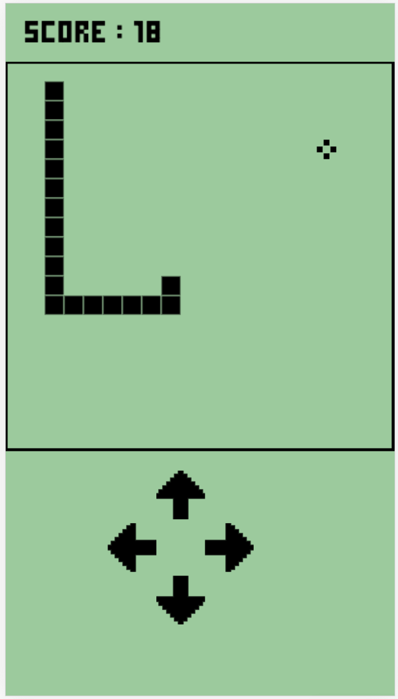
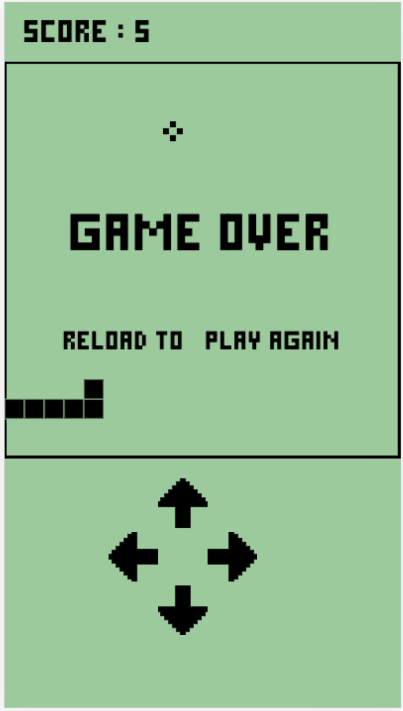

# js-snake

**js-snake** is a classic snake game that a lot of us were addicted to playing on our cellphones. It builded using HTML, CSS, and Vanilla Javascript

[**Play The Game**] **https://zakiarsyad.github.io/js-snake/**

  

[**How to play**]
- If you are in mobile phone, move the snake by touch the arrow button
- Or use your keyboard arrow key to control it
- The snake is looking for food
- If you eat one, the snake will get longer
- If you hit the wall or your tail, the game will be over
- Eat the food as many as you can, and don't hit it
